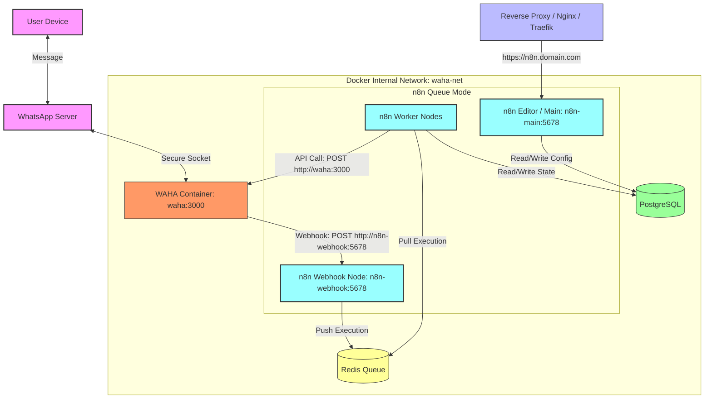
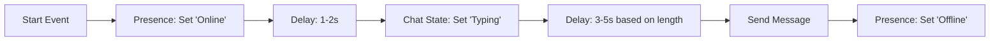
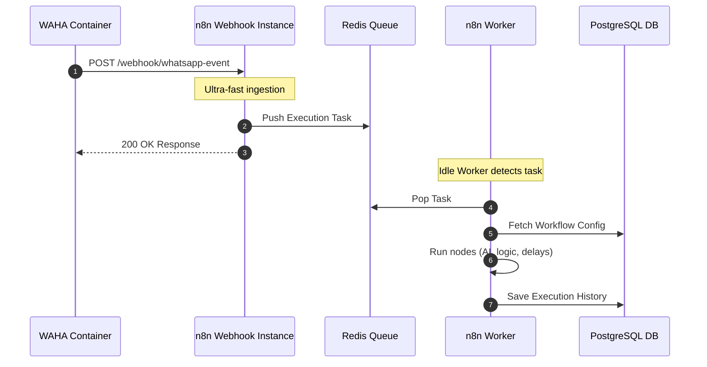

# n8n & WAHA (WhatsApp HTTP API) Production Integration Guide

Integrating **n8n** with **WAHA (WhatsApp HTTP API)** is a powerful way to build robust, scalable chat automation, customer service bots, and notification systems. However, moving this setup to production requires careful planning around session persistence, Docker networking, anti-ban protections, and n8n scalability (Queue Mode).

This guide explains how these systems interact, provides a visual architecture diagram, details production best practices, and includes a reference `docker-compose.yml` setup.

---

## 1. System Architecture & Data Flow

At its core, WAHA acts as an API gateway that translates standard HTTP requests and Webhooks into the WhatsApp web/socket protocol, while n8n serves as the orchestrator logic.

### Obsidian-Compatible Architecture Diagram

The diagram below shows how WAHA, n8n, Redis, and PostgreSQL interact within an internal Docker network, utilizing n8n's **Queue Mode** for high throughput.



---

## 2. Production Best Practices

### A. Session Persistence
When you scan a QR code in WAHA to authenticate a WhatsApp number, a **Session** is created. If the WAHA container restarts and you haven't configured persistence, the session is lost, forcing you to re-scan the QR code.

*   **Host Volume Mounts:** You must persist the directory where WAHA stores local authentication data. Mount a local directory to `/data` in the WAHA container.
    *   *Path inside container:* `/data` (where WhatsApp session state, keys, and temporary downloaded files are stored).
*   **Engine-Specific Considerations:**
    *   **`WEBJS` (default Playwright engine):** Stores sessions inside a Chrome profile structure under `/data/waha/sessions`. It is highly sensitive to filesystem locks and permissions. Ensure the host folder has correct read/write permissions (`chmod -R 777` or matching container UID/GID).
    *   **`BAILEYS` (socket-based engine):** Generally faster and uses less CPU/RAM, but sessions are stored as raw JSON/LevelDB files. Ensure regular backups of your session folders.
*   **Backups:** Periodically compress and backup the session directory. If a VPS crashes, restoring the session folder to a new instance will resume operations immediately without re-pairing.

---

### B. Network Resolution (Internal Docker Routing)
In production, you want to minimize latency, avoid roundtrips to the public internet, and prevent security vulnerabilities by using Docker's internal DNS resolution.

*   **The Webhook Loop Problem:** By default, n8n generates webhook URLs based on the `WEBHOOK_URL` environment variable (e.g., `https://n8n.yourcompany.com`). If you register this public URL in WAHA, WAHA will send webhooks out to the internet, through your reverse proxy, and back down to n8n.
*   **Docker DNS Resolution:**
    *   Run WAHA and n8n on the same Docker network (e.g., `waha-net`).
    *   Point WAHA's webhook target directly to the n8n webhook instance using the Docker container name:
        `WAHA_WEBHOOK_URL=http://n8n-webhook:5678/webhook/` (for active workflows) or use internal n8n service routing.
    *   Point n8n's HTTP Request nodes to WAHA using the hostname `http://waha:3000` rather than its public DNS.
*   **SSL/TLS Configuration:** Since the internal Docker network is isolated and trusted, you can use plain `http` between containers, bypassing SSL overhead. Secure the ingress at your reverse proxy (e.g., Nginx, Caddy, Traefik) which faces the public internet.

---

### C. Anti-Ban Defenses (Rate Limiting & Human Simulation)
WhatsApp uses machine learning and behavior analysis to detect and ban automated bots. Your integration must mimic human behavior as closely as possible.

> [!WARNING]
> Sending bulk automated template messages to cold leads who did not opt-in is the quickest way to get a permanent number ban.

#### 1. Simulate Human Typing & Presence
Before sending a message, trigger presence actions using the WAHA API. In your n8n workflow, build the following sequence:



*   **API Calls for Simulation:**
    *   Use `POST /api/presence` to set the presence state to `online`.
    *   Use `POST /api/chat/startTyping` to show the "typing..." indicator.
    *   Wait a calculated delay (e.g., 50ms per character of the message).
    *   Send the message via `POST /api/sendText`.
    *   Use `POST /api/presence` to set status back to `offline` or let it time out.

#### 2. Rate Limiting & Randomized Delays
*   Do not send messages instantly back-to-back.
*   Use n8n's **Wait Node** with a dynamic code block to randomize the duration:
    ```javascript
    // Calculate a random delay between 2000ms and 5000ms
    return {
      delayMs: Math.floor(Math.random() * (5000 - 2000 + 1)) + 2000
    };
    ```
*   Implement a token bucket or queue in n8n using Redis or an external queue if you have campaigns that push notifications out to hundreds of users.

#### 3. Message Personalization (Variability)
*   **Spin Syntax (Spintax):** Avoid sending the exact same text template. Rotate greetings, sign-offs, and sentence structures.
    *   *Example:* `[Hello|Hi|Greetings] {{ $json.name }}, [how can I help you today?|what can I do for you?]`
*   Use LLM API nodes (OpenAI, Anthropic) in n8n to rewrite notifications dynamically to maintain a completely unique conversational fingerprint.
*   **Verify Number Validity:** Check if a number is active on WhatsApp using `POST /api/contacts/check` before sending. Attempting to message non-existent numbers flags your account for spam.

---

### D. n8n Queue Mode (Scaling for Spikes)
WAHA webhooks can be extremely chatty. When an active WhatsApp account joins a busy group, or when a user syncs historical chats, WAHA fires hundreds of webhooks per minute. A single-instance n8n (using default SQLite) will encounter database locks, run out of memory, or drop connections.

#### Why Queue Mode is Required
In **Queue Mode**, n8n separates responsibilities into distinct container roles:
1.  **n8n Main (Editor):** Serves the UI, schedules cron jobs, and saves configurations.
2.  **n8n Webhook Processors:** Ultra-lightweight containers dedicated exclusively to receiving incoming webhook HTTP calls from WAHA. They put the webhook payload into a Redis queue immediately and respond to WAHA with a `200 OK`, ensuring WAHA doesn't timeout or retry.
3.  **Redis:** Acts as a broker, queueing executions.
4.  **n8n Workers:** Grab executions from the Redis queue and process the heavy logic (database queries, AI APIs, HTTP calls to WAHA). You can scale workers up or down independently of webhooks.



---

## 3. Reference Production `docker-compose.yml`

This setup provisions a production-ready, highly available structure on a single host. It configures WAHA with local persistence and provisions n8n in **Queue Mode** with a PostgreSQL database and a Redis backend.

```yaml
version: '3.8'

networks:
  waha-net:
    driver: bridge

volumes:
  db_data:
  redis_data:
  n8n_shared:
  waha_data:

services:
  # ----------------------------------------------------
  # DATABASE BACKEND (PostgreSQL)
  # ----------------------------------------------------
  postgres:
    image: postgres:16-alpine
    container_name: postgres
    restart: always
    environment:
      POSTGRES_USER: n8n_admin
      POSTGRES_PASSWORD: SecretSecurePasswordChangeMe!
      POSTGRES_DB: n8n_prod
    volumes:
      - db_data:/var/lib/postgresql/data
    networks:
      - waha-net
    healthcheck:
      test: ["CMD-SHELL", "pg_isready -U n8n_admin -d n8n_prod"]
      interval: 5s
      timeout: 5s
      retries: 5

  # ----------------------------------------------------
  # QUEUE BROKER (Redis)
  # ----------------------------------------------------
  redis:
    image: redis:7-alpine
    container_name: redis
    restart: always
    volumes:
      - redis_data:/data
    networks:
      - waha-net
    command: redis-server --appendonly yes
    healthcheck:
      test: ["CMD", "redis-cli", "ping"]
      interval: 5s
      timeout: 5s
      retries: 5

  # ----------------------------------------------------
  # WAHA (WhatsApp HTTP API)
  # ----------------------------------------------------
  waha:
    image: devlikeapro/waha:latest
    container_name: waha
    restart: always
    ports:
      - "3000:3000" # Expose API locally/internally
    environment:
      - WAHA_ENGINE=WEBJS # Choose: WEBJS (Playwright) or BAILEYS (Sockets)
      # Point to internal docker webhook receiver
      - WAHA_WEBHOOK_URL=http://n8n-webhook:5678/webhook/waha-trigger
      - WAHA_WEBHOOK_EVENTS=message,message.any,state.change
      # Security (Protect your API with a key)
      - WAHA_API_KEY=WAHA_SUPER_SECRET_KEY
    volumes:
      - waha_data:/data # Crucial for session persistence
    networks:
      - waha-net
    depends_on:
      - postgres
      - redis

  # ----------------------------------------------------
  # n8n MAIN CONTAINER (Editor & Scheduler)
  # ----------------------------------------------------
  n8n-main:
    image: docker.n8n.io/n8nio/n8n:latest
    container_name: n8n-main
    restart: always
    ports:
      - "5678:5678" # Expose UI/Editor (behind reverse proxy)
    environment:
      - N8N_HOST=n8n.yourdomain.com
      - N8N_PORT=5678
      - N8N_PROTOCOL=https
      - NODE_ENV=production
      # DB Settings
      - DB_TYPE=postgresdb
      - DB_POSTGRESDB_HOST=postgres
      - DB_POSTGRESDB_PORT=5432
      - DB_POSTGRESDB_DATABASE=n8n_prod
      - DB_POSTGRESDB_USER=n8n_admin
      - DB_POSTGRESDB_PASSWORD=SecretSecurePasswordChangeMe!
      # Queue Configuration
      - EXECUTIONS_MODE=queue
      - QUEUE_BULL_REDIS_HOST=redis
      - QUEUE_BULL_REDIS_PORT=6379
      # Encryption Key
      - N8N_ENCRYPTION_KEY=GenerateAStrongRandomStringHere!
    volumes:
      - n8n_shared:/home/node/.n8n
    networks:
      - waha-net
    depends_on:
      postgres:
        condition: service_healthy
      redis:
        condition: service_healthy

  # ----------------------------------------------------
  # n8n WEBHOOK PROCESSOR (Stateless Intake)
  # ----------------------------------------------------
  n8n-webhook:
    image: docker.n8n.io/n8nio/n8n:latest
    container_name: n8n-webhook
    restart: always
    command: webhook
    environment:
      - N8N_HOST=n8n.yourdomain.com
      - NODE_ENV=production
      - DB_TYPE=postgresdb
      - DB_POSTGRESDB_HOST=postgres
      - DB_POSTGRESDB_PORT=5432
      - DB_POSTGRESDB_DATABASE=n8n_prod
      - DB_POSTGRESDB_USER=n8n_admin
      - DB_POSTGRESDB_PASSWORD=SecretSecurePasswordChangeMe!
      - EXECUTIONS_MODE=queue
      - QUEUE_BULL_REDIS_HOST=redis
      - QUEUE_BULL_REDIS_PORT=6379
      - N8N_ENCRYPTION_KEY=GenerateAStrongRandomStringHere!
    volumes:
      - n8n_shared:/home/node/.n8n
    networks:
      - waha-net
    depends_on:
      - n8n-main

  # ----------------------------------------------------
  # n8n WORKER (Workflow Executor)
  # ----------------------------------------------------
  n8n-worker:
    image: docker.n8n.io/n8nio/n8n:latest
    # container_name omitted to allow scaling using --scale
    restart: always
    command: worker
    environment:
      - NODE_ENV=production
      - DB_TYPE=postgresdb
      - DB_POSTGRESDB_HOST=postgres
      - DB_POSTGRESDB_PORT=5432
      - DB_POSTGRESDB_DATABASE=n8n_prod
      - DB_POSTGRESDB_USER=n8n_admin
      - DB_POSTGRESDB_PASSWORD=SecretSecurePasswordChangeMe!
      - EXECUTIONS_MODE=queue
      - QUEUE_BULL_REDIS_HOST=redis
      - QUEUE_BULL_REDIS_PORT=6379
      - N8N_ENCRYPTION_KEY=GenerateAStrongRandomStringHere!
    volumes:
      - n8n_shared:/home/node/.n8n
    networks:
      - waha-net
    depends_on:
      - n8n-main

---

## 4. Setup & Deployment Guide

Deploying this entire stack in a single `docker-compose.yml` ensures all services boot in the correct dependency order, share internal DNS names, and are isolated within the same private network.

### Step 1: Prepare the Directories & Host Environment
On your server (e.g. `Battlemage`), create a folder for the stack and initialize the local directories to ensure Docker has write access:

```bash
mkdir -p ~/waha-n8n-stack/waha_data
mkdir -p ~/waha-n8n-stack/n8n_shared
cd ~/waha-n8n-stack
```

Ensure permissions are open for container-mount directories if you run into permissions errors (especially on Linux setups with non-root Docker engines):
```bash
chmod -R 777 waha_data n8n_shared
```

### Step 2: Configure Environment Secrets
Create a `.env` file in `~/waha-n8n-stack/.env` to separate passwords and keys from the `docker-compose.yml` file.

```ini
# Database configuration
POSTGRES_USER=n8n_admin
POSTGRES_PASSWORD=UseAStrongPassword123!
POSTGRES_DB=n8n_prod

# WAHA configuration
WAHA_API_KEY=YourWahaSuperSecretKeyGoesHere

# n8n configuration
N8N_ENCRYPTION_KEY=YourUniqueN8nEncryptionSecretKey
N8N_DOMAIN=n8n.yourdomain.com
```

> [!NOTE]
> Update the environment variables in your `docker-compose.yml` to reference these `.env` variables (e.g., `${POSTGRES_USER}`, `${WAHA_API_KEY}`, etc.) to keep your credentials secure and decoupled.

### Step 3: Run the Stack
Deploy the stack in detached mode:

```bash
docker compose up -d
```

Docker Compose will:
1. Create the internal bridge network `waha-net`.
2. Spin up `postgres` and `redis`, waiting for their health checks to pass.
3. Boot up the WAHA container, n8n-main (Editor), n8n-webhook (Receiver), and n8n-worker (Executor).

### Step 4: Scale the n8n Workers
If your WhatsApp automation processes high message volume (e.g. sending bulk updates, heavy AI response generations, or multiple media downloads), you can scale your n8n Workers instantly.

Because we omitted the `container_name` from the `n8n-worker` service, Docker Compose can run multiple instances:

```bash
# Scale to 3 active worker containers running concurrently
docker compose up -d --scale n8n-worker=3
```

This will run `waha-n8n-stack-n8n-worker-1`, `waha-n8n-stack-n8n-worker-2`, and `waha-n8n-stack-n8n-worker-3`. They will automatically register with Redis and start processing queued events from the n8n-webhook container.

### Step 5: Connecting WAHA to n8n
To complete the loop, n8n must listen to webhooks fired by WAHA.

1. Open your **n8n Editor** (e.g. at `https://n8n.yourdomain.com`).
2. Create a new Workflow and add a **Webhook Node**.
   * Set the HTTP Method to `POST`.
   * Set the Path to `waha-trigger` (matching the `WAHA_WEBHOOK_URL` suffix).
   * Note the Webhook URL. It will look like `http://n8n-webhook:5678/webhook/waha-trigger` from within the Docker network.
3. Save and **Activate** the workflow in n8n.
4. Open the WAHA API Swagger UI (typically at `http://YOUR_SERVER_IP:3000` or via reverse proxy).
5. If not set via docker-compose environment variables, register the webhook using the `POST /api/webhooks` endpoint:
   ```json
   {
     "url": "http://n8n-webhook:5678/webhook/waha-trigger",
     "events": ["message", "message.any", "state.change"],
     "enabled": true
   }
   ```

### Step 6: Verify Queue Execution
To verify that n8n Queue Mode is functioning correctly:
1. Check the logs of the webhook container:
   ```bash
   docker logs n8n-webhook
   ```
   You should see logs indicating the webhook container started in `webhook` mode.
2. Check the logs of your workers to see them pulling tasks from the queue:
   ```bash
   docker logs -f waha-n8n-stack-n8n-worker-1
   ```
3. To inspect the active Redis queue, run:
   ```bash
   docker exec -it redis redis-cli KEYS "bull:*"
   ```
   If Redis contains keys starting with `bull:queue` (n8n's queue engine), the queue broker is configured and active.

