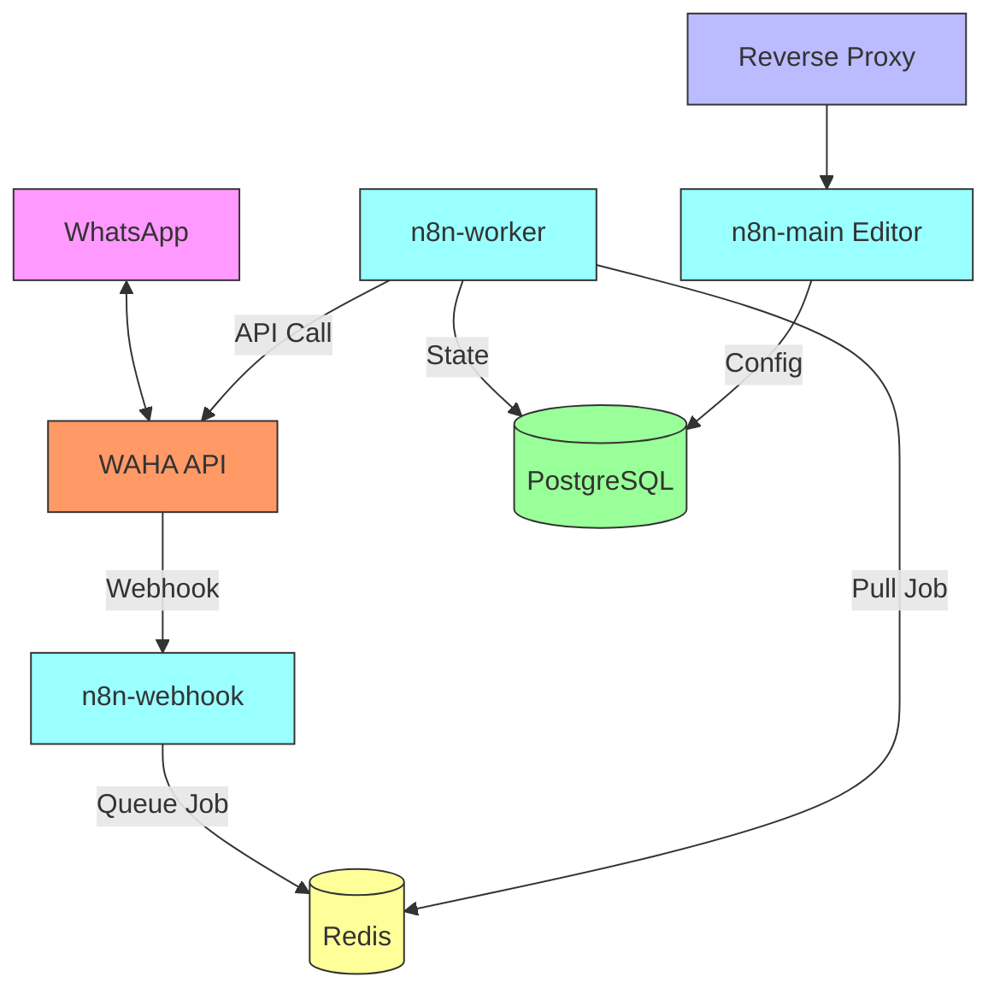
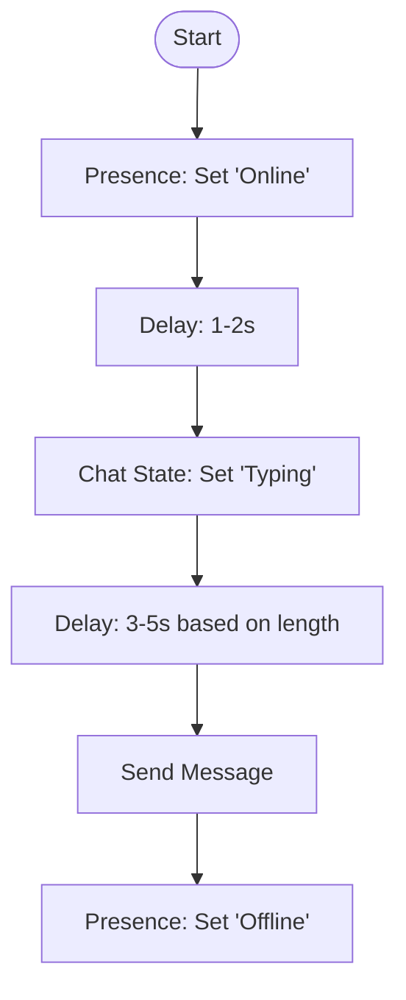
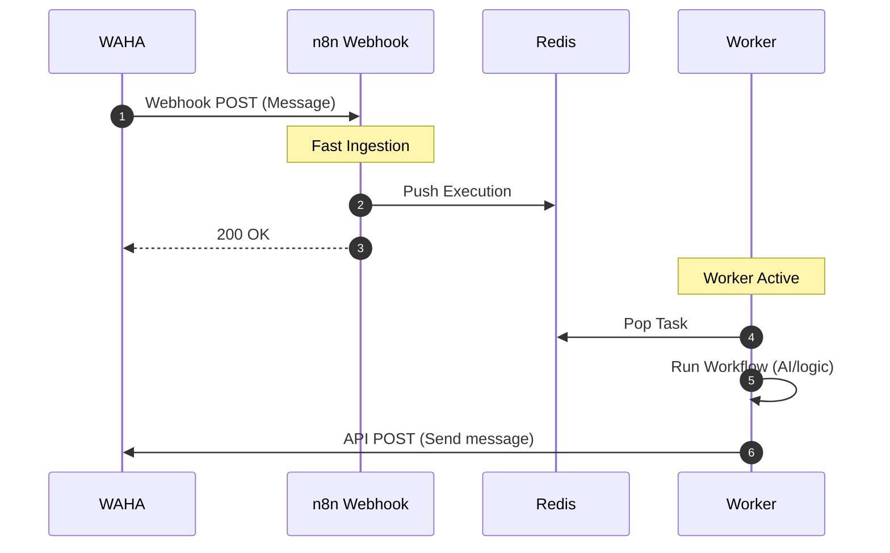

# Self-Hosting WAHA & n8n in Production: A Complete Setup & Backup Guide

Self-hosting **WAHA (WhatsApp HTTP API)** alongside **n8n** gives you full control over your customer automation pipeline, keeps your data private, and eliminates monthly subscription fees. However, running these services in production requires a solid self-hosted deployment strategy, automated backup procedures, and anti-ban safeguards.

This guide focuses on deploying a self-hosted stack using the lightweight **BAILEYS** engine and setting up automated backups.

---

## 1. Engine Selection: WEBJS vs. BAILEYS

When self-hosting WAHA, choosing the right WhatsApp driver (engine) is the most critical decision for server resource consumption:

| Feature         | `WEBJS` Engine (Playwright/Chrome)            | `BAILEYS` Engine (WebSockets)                          |
| :-------------- | :-------------------------------------------- | :----------------------------------------------------- |
| **Technology**  | Headless Chrome (via Puppeteer/Playwright)    | Pure Node.js WebSocket implementation                  |
| **RAM Usage**   | **High** (~300MB - 500MB per active session)  | **Very Low** (~50MB - 100MB per active session)        |
| **CPU Usage**   | High (rendering pages, running layout engine) | Minimal (only processes network messages)              |
| **VPS Fit**     | Requires a VPS with 2GB+ RAM                  | Runs comfortably on a 1GB RAM $5 VPS                   |
| **Stability**   | Very high (mimics a real browser)             | High (requires updates when WhatsApp protocol changes) |
| **Persistence** | Large folder structure (browser profile)      | Tiny JSON state & LevelDB files                        |

> [!TIP]
> **For self-hosting on lightweight VPS instances, the `BAILEYS` engine is highly recommended.** It uses a fraction of the memory and CPU, allowing you to run multiple WhatsApp sessions on cheap hardware.

---

## 2. Infrastructure Architecture

The diagram below shows how WAHA, n8n, Redis, and PostgreSQL communicate over a private, internal Docker network. Webhooks and API calls bypass the public internet entirely to reduce latency and enhance security.



---

## 3. Self-Hosted Stack Configuration (`docker-compose.yml`)

Save this configuration as `docker-compose.yml` in your stack directory. It configures WAHA to use the light **BAILEYS** engine and sets up n8n in **Queue Mode** with PostgreSQL and Redis.

```yaml
version: '3.8'

networks:
  waha-net:
    driver: bridge

volumes:
  db_data:
  redis_data:
  n8n_shared:
  waha_data:

services:
  # ----------------------------------------------------
  # DATABASE BACKEND (PostgreSQL)
  # ----------------------------------------------------
  postgres:
    image: postgres:16-alpine
    container_name: postgres
    restart: always
    environment:
      POSTGRES_USER: ${POSTGRES_USER:-n8n_admin}
      POSTGRES_PASSWORD: ${POSTGRES_PASSWORD:-SecretSecurePasswordChangeMe!}
      POSTGRES_DB: ${POSTGRES_DB:-n8n_prod}
    volumes:
      - db_data:/var/lib/postgresql/data
    networks:
      - waha-net
    healthcheck:
      test: ["CMD-SHELL", "pg_isready -U n8n_admin -d n8n_prod"]
      interval: 5s
      timeout: 5s
      retries: 5

  # ----------------------------------------------------
  # QUEUE BROKER (Redis)
  # ----------------------------------------------------
  redis:
    image: redis:7-alpine
    container_name: redis
    restart: always
    volumes:
      - redis_data:/data
    networks:
      - waha-net
    command: redis-server --appendonly yes
    healthcheck:
      test: ["CMD", "redis-cli", "ping"]
      interval: 5s
      timeout: 5s
      retries: 5

  # ----------------------------------------------------
  # WAHA (WhatsApp HTTP API using BAILEYS Engine)
  # ----------------------------------------------------
  waha:
    image: devlikeapro/waha:latest
    container_name: waha
    restart: always
    ports:
      - "3000:3000" # Swagger UI access
    environment:
      - WAHA_ENGINE=BAILEYS # Optimized socket-based engine
      - WAHA_WEBHOOK_URL=http://n8n-webhook:5678/webhook/waha-trigger
      - WAHA_WEBHOOK_EVENTS=message,message.any,state.change
      - WAHA_API_KEY=${WAHA_API_KEY:-WAHA_SUPER_SECRET_KEY}
    volumes:
      - waha_data:/data # Critical: Stores Baileys JSON authentication keys
    networks:
      - waha-net
    depends_on:
      - postgres
      - redis

  # ----------------------------------------------------
  # n8n MAIN CONTAINER (Editor & Scheduler)
  # ----------------------------------------------------
  n8n-main:
    image: docker.n8n.io/n8nio/n8n:latest
    container_name: n8n-main
    restart: always
    ports:
      - "5678:5678" # Main Web Interface
    environment:
      - N8N_HOST=${N8N_DOMAIN:-n8n.yourdomain.com}
      - N8N_PORT=5678
      - N8N_PROTOCOL=https
      - NODE_ENV=production
      - DB_TYPE=postgresdb
      - DB_POSTGRESDB_HOST=postgres
      - DB_POSTGRESDB_PORT=5432
      - DB_POSTGRESDB_DATABASE=${POSTGRES_DB:-n8n_prod}
      - DB_POSTGRESDB_USER=${POSTGRES_USER:-n8n_admin}
      - DB_POSTGRESDB_PASSWORD=${POSTGRES_PASSWORD:-SecretSecurePasswordChangeMe!}
      - EXECUTIONS_MODE=queue
      - QUEUE_BULL_REDIS_HOST=redis
      - QUEUE_BULL_REDIS_PORT=6379
      - N8N_ENCRYPTION_KEY=${N8N_ENCRYPTION_KEY:-GenerateAStrongRandomStringHere!}
    volumes:
      - n8n_shared:/home/node/.n8n
    networks:
      - waha-net
    depends_on:
      postgres:
        condition: service_healthy
      redis:
        condition: service_healthy

  # ----------------------------------------------------
  # n8n WEBHOOK PROCESSOR (Stateless Intake)
  # ----------------------------------------------------
  n8n-webhook:
    image: docker.n8n.io/n8nio/n8n:latest
    container_name: n8n-webhook
    restart: always
    command: webhook
    environment:
      - N8N_HOST=${N8N_DOMAIN:-n8n.yourdomain.com}
      - NODE_ENV=production
      - DB_TYPE=postgresdb
      - DB_POSTGRESDB_HOST=postgres
      - DB_POSTGRESDB_PORT=5432
      - DB_POSTGRESDB_DATABASE=${POSTGRES_DB:-n8n_prod}
      - DB_POSTGRESDB_USER=${POSTGRES_USER:-n8n_admin}
      - DB_POSTGRESDB_PASSWORD=${POSTGRES_PASSWORD:-SecretSecurePasswordChangeMe!}
      - EXECUTIONS_MODE=queue
      - QUEUE_BULL_REDIS_HOST=redis
      - QUEUE_BULL_REDIS_PORT=6379
      - N8N_ENCRYPTION_KEY=${N8N_ENCRYPTION_KEY:-GenerateAStrongRandomStringHere!}
    volumes:
      - n8n_shared:/home/node/.n8n
    networks:
      - waha-net
    depends_on:
      - n8n-main

  # ----------------------------------------------------
  # n8n WORKER (Workflow Executor)
  # ----------------------------------------------------
  n8n-worker:
    image: docker.n8n.io/n8nio/n8n:latest
    restart: always
    command: worker
    environment:
      - NODE_ENV=production
      - DB_TYPE=postgresdb
      - DB_POSTGRESDB_HOST=postgres
      - DB_POSTGRESDB_PORT=5432
      - DB_POSTGRESDB_DATABASE=${POSTGRES_DB:-n8n_prod}
      - DB_POSTGRESDB_USER=${POSTGRES_USER:-n8n_admin}
      - DB_POSTGRESDB_PASSWORD=${POSTGRES_PASSWORD:-SecretSecurePasswordChangeMe!}
      - EXECUTIONS_MODE=queue
      - QUEUE_BULL_REDIS_HOST=redis
      - QUEUE_BULL_REDIS_PORT=6379
      - N8N_ENCRYPTION_KEY=${N8N_ENCRYPTION_KEY:-GenerateAStrongRandomStringHere!}
    volumes:
      - n8n_shared:/home/node/.n8n
    networks:
      - waha-net
    depends_on:
      - n8n-main
```

---

## 4. Self-Hosted Data Persistence & Backups

When running this stack, your critical database states and WhatsApp connection keys must be preserved. If your server dies and you lose the WAHA directory, **your WhatsApp accounts will disconnect, forcing you to manually re-scan the QR code for every device**.

### What Needs to be Backed Up?
1.  **WAHA Session Storage:** In `BAILEYS` mode, this is the `waha_data` directory. It contains session keys, JSON credentials, and local caching.
2.  **n8n Configuration & History:** Stored in the PostgreSQL database (`db_data` volume) and n8n shared static assets (`n8n_shared`).

### Automated Backup Strategy
We can write a backup script that runs nightly via `cron`. It exports a database snapshot and compresses the local volumes, then optionally pushes the backup file to remote storage (e.g. AWS S3, Cloudflare R2, Backblaze B2, or another server) to avoid data loss in the event of local VPS hardware failure.

#### 1. Setup the Backup Script
Create a script on your host machine named `backup.sh` in your stack folder:

```bash
#!/bin/bash
# backup.sh - Automated Backup Script for WAHA and n8n

# --- Configuration ---
STACK_DIR="/home/yaku/waha-n8n-stack"
BACKUP_DIR="/backups"
TIMESTAMP=$(date +"%Y%m%d_%H%M%S")
RETENTION_DAYS=7

# Load variables from .env
if [ -f "$STACK_DIR/.env" ]; then
    export $(grep -v '^#' "$STACK_DIR/.env" | xargs)
fi

DB_USER=${POSTGRES_USER:-n8n_admin}
DB_NAME=${POSTGRES_DB:-n8n_prod}

mkdir -p "$BACKUP_DIR"

echo "[$(date)] Starting Backup..."

# 1. Hot-export the PostgreSQL database state
docker exec postgres pg_dump -U "$DB_USER" "$DB_NAME" > "$BACKUP_DIR/n8n_db_$TIMESTAMP.sql"

# 2. Archive WAHA session folder & n8n shared files
# Docker volumes usually mount in /var/lib/docker/volumes/
# If using local directories in docker-compose, archive directly from STACK_DIR:
tar -czf "$BACKUP_DIR/waha_sessions_$TIMESTAMP.tar.gz" -C "$STACK_DIR" waha_data n8n_shared

# 3. Compress database dump to save space
gzip "$BACKUP_DIR/n8n_db_$TIMESTAMP.sql"

# 4. Optional: Upload to remote cloud storage using rclone (S3/B2/R2)
# Ensure rclone is configured on the host machine: 'rclone config'
# rclone copy "$BACKUP_DIR/*_$TIMESTAMP*" remote:my-bucket-name/backups/

# 5. Clean up local backups older than RETENTION_DAYS
find "$BACKUP_DIR" -type f -mtime +$RETENTION_DAYS -delete

echo "[$(date)] Backup Completed successfully."
```

#### 2. Schedule the Script
Make the script executable:
```bash
chmod +x ~/waha-n8n-stack/backup.sh
```

Add it to your system's `cron` jobs to run daily at 2:00 AM. Open the crontab editor:
```bash
crontab -e
```

Add the following line:
```cron
0 2 * * * /home/yaku/waha-n8n-stack/backup.sh >> /var/log/waha_backup.log 2>&1
```

---

## 5. Disaster Recovery: Restoring Your Sessions

If you need to migrate to a new server or recover from a server crash:

1.  Set up the folder structure on the new server:
    ```bash
    mkdir -p ~/waha-n8n-stack
    ```
2.  Restore the configuration files (`docker-compose.yml` and your `.env`).
3.  Extract the session archive back into the stack directory:
    ```bash
    tar -xzf waha_sessions_YYYYMMDD_HHMMSS.tar.gz -C ~/waha-n8n-stack/
    ```
4.  Start the database container first to prepare for import:
    ```bash
    docker compose up -d postgres
    ```
5.  Restore the database dump:
    ```bash
    gunzip n8n_db_YYYYMMDD_HHMMSS.sql.gz
    docker cp n8n_db_YYYYMMDD_HHMMSS.sql postgres:/tmp/restore.sql
    docker exec -it postgres psql -U n8n_admin -d n8n_prod -f /tmp/restore.sql
    ```
6.  Start the rest of the stack:
    ```bash
    docker compose up -d
    ```

Because the BAILEYS keys in `waha_data` match the session signature, WAHA will connect instantly without needing to scan QR codes.

---

## 6. Network Resolution (Internal Docker Routing)

To prevent security vulnerabilities and reduce request times, internal communication must stay inside the Docker bridge network.

*   **Webhook Destination (WAHA -> n8n):**
    WAHA sends events to n8n. Instead of using your public domain (e.g. `https://n8n.domain.com`), point WAHA to the internal container host:
    `WAHA_WEBHOOK_URL=http://n8n-webhook:5678/webhook/waha-trigger`
*   **API Calls (n8n -> WAHA):**
    When n8n workers send a message back via WAHA, the HTTP Request nodes in n8n should call the internal name:
    `http://waha:3000/api/sendText`
*   **External Access (Reverse Proxy):**
    Use a reverse proxy (Nginx, Traefik, or Caddy) to expose the main editor (`n8n-main:5678`) and the WAHA documentation page (`waha:3000`) securely to the web with SSL/TLS certificates.

---

## 7. Anti-Ban Defenses (Rate Limiting & Human Simulation)

WhatsApp uses AI algorithms to analyze user behaviors. If your automated bot acts like a script, it will get banned.

### 1. Presence & Typing Simulation Flow
Always simulate human presence actions before sending message data:



*   **API Actions:**
    *   Set status to `online` (`POST /api/presence`).
    *   Turn on the `typing...` status (`POST /api/chat/startTyping`).
    *   Set a delay of a few seconds (mimicking typing speed).
    *   Send the text (`POST /api/sendText`).
    *   Turn off typing and return status to `offline`.

### 2. Randomized Delay in n8n
Do not reply instantly. Add a **Wait Node** in n8n and use a dynamic code block to randomize the wait time (e.g. between 2 to 5 seconds):

```javascript
return {
  delayMs: Math.floor(Math.random() * (5000 - 2000 + 1)) + 2000
};
```

---

## 8. n8n Queue Mode Operation

Running n8n in Queue Mode ensures that webhook floods (e.g. when your WhatsApp account receives messages from busy groups) are loaded into **Redis** rather than overwhelming n8n's main memory or locking database tables.



### Scaling Worker Instances
If your queues get congested, scale the number of execution workers dynamically from your host server:

```bash
docker compose up -d --scale n8n-worker=3
```
This deploys three parallel worker containers that consume tasks from Redis simultaneously, ensuring that message processing times remain low under heavy loads.
