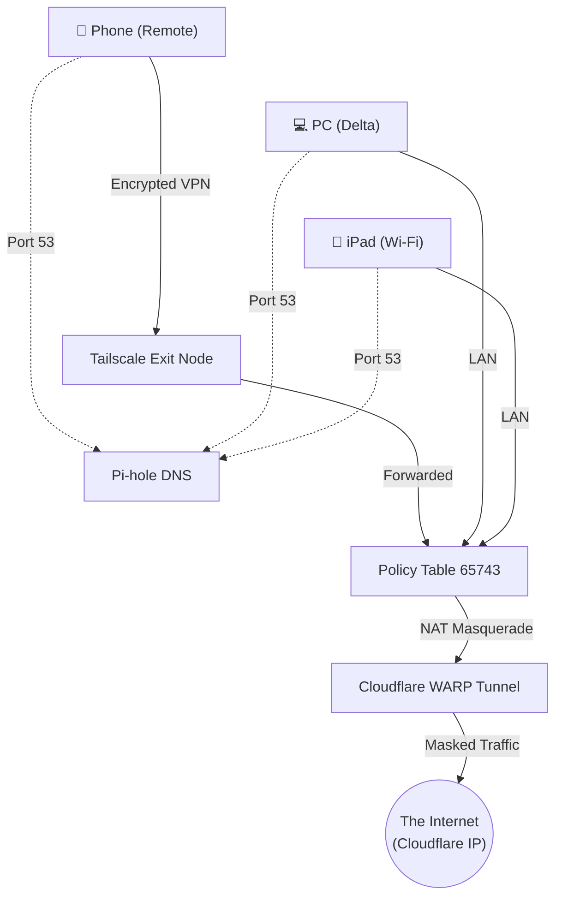
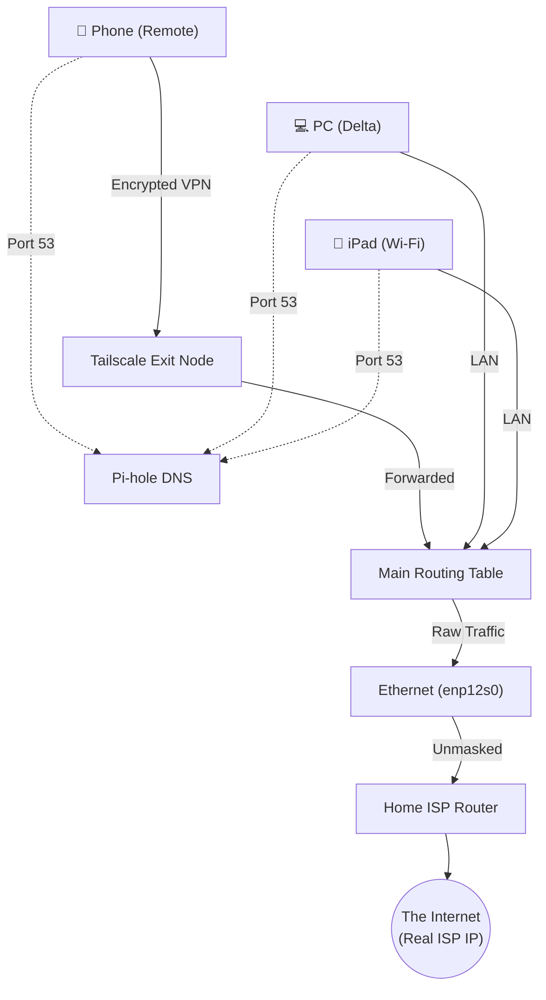

# The Ultimate Guide: Masking Homelab & Tailscale Traffic with Cloudflare WARP

  

This guide is a comprehensive, end-to-end walkthrough of how we successfully routed an entire homelab Local Area Network (LAN) and a Tailscale Exit Node through Cloudflare WARP. The ultimate goal was to mask the server's public IP address behind Cloudflare's network while preserving a custom DNS stack consisting of Pi-hole and Cloudflared (Quad9 DNS over HTTPS).

This document details every roadblock we encountered, the exact technical mechanisms causing them, and the code used to solve them.

---
## Network Traffic Flow (Visualized)

To understand exactly how this magic works, here is a visual breakdown of how traffic flows from your devices to the internet depending on whether WARP is active or disabled.
### State 1: WARP is ON (`warpon`)

When WARP is active, a custom firewall rule intercepts all internet-bound traffic from your LAN and Tailscale clients. It shoves this traffic into a hidden routing table (`Table 65743`) which acts as a funnel directly into the Cloudflare encrypted tunnel. Your true ISP address is completely hidden. All DNS queries bypass WARP and hit Pi-hole directly.



### State 2: WARP is OFF (`warpoff`)

When WARP is manually disconnected, the `CloudflareWARP` interface disappears. Because the custom routing table (`Table 65743`) empties out, the Linux kernel smartly "falls through" to the default `main` routing table. Traffic routes normally out of your physical ethernet port to your home ISP router. Everything continues to work seamlessly, but your real public IP is exposed.



  

---
## 1. Architectural Overview

**The Goal:**

All devices on the physical LAN (e.g., an iPad or PC) and any remote devices connected via Tailscale must have their internet traffic encrypted and masked by Cloudflare WARP. Simultaneously, all devices must be forced to use the local Pi-hole for ad-blocking, which in turn securely resolves queries via Quad9.

**The Components:**

* **Battlemage (The Router/Server):** An Ubuntu Linux machine acting as the central gateway.

* **Tailscale:** Creating the mesh VPN and acting as an Exit Node for remote devices.

* **Cloudflare WARP (`warp-cli`):** The VPN tunnel capturing outgoing traffic to mask the ISP IP.

* **Pi-hole (Docker):** Local DNS ad-blocker.

* **Cloudflared (Docker):** DNS-over-HTTPS proxy forwarding Pi-hole queries to Quad9.  

---
## 2. Phase 1: Resolving Port 53 Conflicts

The first major hurdle was getting Cloudflare WARP and Pi-hole to coexist on the same server.
  
When you install Cloudflare WARP on Linux, it runs a local DNS proxy. However, Pi-hole (running in Docker with `network_mode: host`) was aggressively binding to `0.0.0.0:53` (every interface on the machine). Because Pi-hole claimed Port 53 universally, the WARP daemon crashed upon startup because it could not bind its own DNS listener.

**The Fix:**

Instead of letting Pi-hole listen universally, we configured its underlying DNS engine (`dnsmasq`) to bind *only* to the specific IP addresses where it was needed: the LAN interface and the Tailscale interface. This freed up `127.0.0.1:53` and `127.0.2.2:53` for WARP and systemd-resolved.

We created a custom `dnsmasq` configuration file:

`/home/yaku/pihole/etc-dnsmasq.d/01-bind-specific.conf`

```ini

# Do not bind universally

bind-dynamic

  

# Only listen on the LAN and Tailscale IPs

listen-address=192.168.18.51

listen-address=100.86.72.100

listen-address=fd7a:115c:a1e0::ba01:4865

```

Once Pi-hole was restarted, port 53 was freed locally, and Cloudflare WARP was able to start successfully.

---
## 3. Phase 2: Installing and Connecting Cloudflare WARP

With port conflicts resolved, we proceeded to install and configure the WARP client.

```bash

# Register the device with Cloudflare's network

warp-cli registration new

  

# Set the operational mode to WARP (VPN masking)

warp-cli mode warp

  

# Ensure WARP automatically connects on boot

warp-cli connect

warp-cli enable-always-on

```

At this point, Battlemage itself was routing its own traffic through WARP, but the LAN devices and Tailscale clients were completely bypassing the tunnel and leaking the real ISP IP address.

---
## 4. Phase 3: Policy-Based Routing & Firewall Rules (The Magic)
  
To force external devices (LAN and Tailscale clients) into the WARP tunnel, we had to manipulate Linux's networking stack using `iptables` and `ip rule`.

### The Routing Problem

When a packet from the iPad (LAN) or a remote phone (Tailscale) reaches Battlemage, the Linux kernel looks at its main routing table. By default, the main routing table says: "Send this out the physical ethernet port (`enp12s0`) to the ISP router."

Cloudflare WARP operates using Policy-Based Routing. When WARP connects, it creates a hidden routing table (Table `65743`) that points to the `CloudflareWARP` virtual interface. It then adds a rule to catch locally generated traffic and force it into Table `65743`. It intentionally ignores forwarded traffic from other interfaces.

### The Routing Fix

We forcefully injected our LAN and Tailscale traffic into WARP's routing table.

First, we added an `iptables` Network Address Translation (NAT) rule. This masks the source IP of the LAN/Tailscale devices with the WARP interface's IP, allowing the traffic to traverse the tunnel seamlessly:

```bash

iptables -t nat -A POSTROUTING -o CloudflareWARP -j MASQUERADE

```

Next, we added explicit forwarding rules to ensure the firewall didn't drop the packets traversing between the physical/Tailscale interfaces and the WARP interface:

```bash

# Allow Tailscale to WARP

iptables -I FORWARD 1 -i tailscale0 -o CloudflareWARP -j ACCEPT

iptables -I FORWARD 2 -i CloudflareWARP -o tailscale0 -m state --state RELATED,ESTABLISHED -j ACCEPT

  

# Allow LAN to WARP

iptables -I FORWARD 3 -i enx9c69d3198bc0 -o CloudflareWARP -j ACCEPT

iptables -I FORWARD 4 -i CloudflareWARP -o enx9c69d3198bc0 -m state --state RELATED,ESTABLISHED -j ACCEPT

```

Finally, we hit a known Linux networking bug where Tailscale and WARP clash over MTU sizes and Generic Receive Offload (GRO), causing UDP packets to drop silently. We disabled GRO on the Tailscale interface to fix this:

```bash

ethtool -K tailscale0 rx-gro-list off rx-udp-gro-forwarding off

```
---
## 5. Phase 4: System Persistence on Reboot

Linux forgets `iptables` and `ip rule` commands the moment the server reboots. Furthermore, we couldn't just apply these rules at startup because the `CloudflareWARP` interface doesn't exist until the `warp-svc` daemon fully connects to Cloudflare's servers.

**The Fix:**

We created a custom systemd service that waits for WARP to initialize before forcefully injecting the routing rules.

  

File: `/etc/systemd/system/warp-routing.service`

  

```ini

[Unit]

Description=Setup Routing for Tailscale and LAN through Cloudflare WARP

After=network.target warp-svc.service tailscaled.service

Wants=warp-svc.service tailscaled.service

  

[Service]

Type=oneshot

RemainAfterExit=yes

# Wait for WARP interface to exist

ExecStartPre=/bin/bash -c 'until ip link show CloudflareWARP > /dev/null 2>&1; do sleep 1; done'

  

# Apply NAT MASQUERADE

ExecStart=/sbin/iptables -t nat -A POSTROUTING -o CloudflareWARP -j MASQUERADE

  

# Apply FORWARD rules

ExecStart=/sbin/iptables -I FORWARD 1 -i tailscale0 -o CloudflareWARP -j ACCEPT

ExecStart=/sbin/iptables -I FORWARD 2 -i CloudflareWARP -o tailscale0 -m state --state RELATED,ESTABLISHED -j ACCEPT

ExecStart=/sbin/iptables -I FORWARD 3 -i enx9c69d3198bc0 -o CloudflareWARP -j ACCEPT

ExecStart=/sbin/iptables -I FORWARD 4 -i CloudflareWARP -o enx9c69d3198bc0 -m state --state RELATED,ESTABLISHED -j ACCEPT

  

# Fix UDP packet drops (MTU/GRO issue)

ExecStart=/sbin/ethtool -K tailscale0 rx-gro-list off rx-udp-gro-forwarding off

  

[Install]

WantedBy=multi-user.target

```

  

Enabled with: `sudo systemctl enable warp-routing.service`

  

---

  

## 6. Phase 5: Fixing the DNS Hijack (The Tailscale Admin Console Trap)

  

With the traffic successfully masked by WARP, we discovered a massive problem: DNS queries were failing the Quad9 security test. Devices were bypassing the Pi-hole entirely.

  

**The Diagnosis:**

The user correctly configured the Tailscale Admin Console with the Global Nameserver `100.86.72.100` (the Tailscale IP of the Pi-hole) and checked "Override local DNS". However, Tailscale's MagicDNS has a hidden behavior: *If you provide a 100.x.x.x IP address as a nameserver, Tailscale automatically "upgrades" the connection to use DNS-over-HTTPS (DoH) via port 60252.*

  

Because of this, the PC wasn't sending standard port 53 queries to the Pi-hole. Instead, it was sending DoH queries to the `tailscaled` daemon running on Battlemage.

When Battlemage's `tailscaled` daemon received the query, it looked at Battlemage's system DNS file (`/etc/resolv.conf`) to resolve it.

However, Cloudflare WARP forcefully hijacks `/etc/resolv.conf` to point to its own DNS (`127.0.2.2`).

  

Consequently, the PC asked Battlemage's Tailscale proxy, the proxy asked WARP, and WARP asked Cloudflare. The Pi-hole was completely circumvented.

  

**The Fix:**

We bypassed Tailscale's DoH "upgrade" by removing the `100.x.x.x` IP from the Tailscale Admin Console and replacing it with Battlemage's physical LAN IP: **`192.168.18.51`**.

  

Because `192.168.18.51` is not a Tailscale IP, MagicDNS doesn't attempt to hijack it into DoH. It simply routes standard, unencrypted port 53 UDP packets through the Tailscale tunnel directly to the Pi-hole. We also ensured the **"Use with exit node"** toggle was turned **ON**, preventing Tailscale from discarding the custom DNS when the exit node was active.

  

This flawlessly restored Pi-hole and Quad9 functionality across all devices.

  

---

  

## 7. Phase 6: The Bilibili CDN Block & Split Tunneling Failure

  

The final challenge emerged when attempting to download videos from Bilibili using `yt-dlp` (via Parabolic). The downloads failed instantly with `HTTP Error 412: Precondition Failed`.

  

**The Diagnosis:**

Streaming sites and Chinese platforms employ strict Web Application Firewalls (WAFs). When Bilibili saw the download request originating from a Cloudflare datacenter IP (our WARP tunnel), it classified the request as an automated scraper/bot and blocked it.

  

**The Attempted Split-Tunnel Fix:**

We attempted to bypass WARP exclusively for Bilibili traffic using WARP's split tunnel feature:

`warp-cli tunnel host add bilibili.com`

  

This failed. WARP's domain-based split tunneling *only* works if you are utilizing WARP's internal DNS proxy (`127.0.2.2`). Because we meticulously forced our network to use Pi-hole and Cloudflared/Quad9, WARP never saw the DNS query for Bilibili. Furthermore, Bilibili uses hundreds of obfuscated CDN subdomains (e.g., `a.w.bilicdn1.com`). Because Pi-hole resolved these CNAMES via Quad9, the traffic was funneled directly into the WARP tunnel regardless of our bypass rules.

  

**The Ultimate Fix (Cookies):**

To circumvent playing "whack-a-mole" with hundreds of CDN IP addresses, the solution was to verify our humanity to Bilibili's servers.

By utilizing the **"Pass Cookies"** feature in Parabolic (or `--cookies-from-browser` in `yt-dlp`), we appended valid, authenticated login session tokens to the download request. When Bilibili's firewall received the request, it recognized a verified, logged-in user rather than an anonymous Cloudflare bot, and permitted the download to proceed unhindered through the WARP tunnel.

  

---

  

## 8. Network Behavior & Fallbacks

  

What happens to this delicate architecture if Cloudflare WARP goes down or is manually disconnected (`sudo warp-cli disconnect`)?

  

**Everything degrades gracefully.**

  

1. **The Interface Disappears:** The `CloudflareWARP` virtual network interface drops.

2. **Routing "Falls Through":** Because we utilized Linux's `ip rule` preference hierarchy, when the routing table associated with WARP (`65743`) goes offline, the Linux kernel simply falls through to the next available route: the `main` table.

3. **ISP Restoration:** The `main` table instructs the server to push all traffic out the physical ethernet port (`enp12s0`) to your local ISP router.

4. **No Downtime:** Your Tailscale exit node, iPad, and PC will seamlessly transition back to using your ISP's real, unmasked IP address. Pi-hole and Quad9 will continue resolving ad-free DNS exactly as they were.

  

Once `warp-cli connect` is executed again, the WARP interface spins up, the routing table repopulates, and the traffic is instantly swallowed back into the encrypted tunnel.

  

### Performance Impact

Using this architecture introduces a marginal speed penalty (typically a 5% to 15% reduction in peak bandwidth). This is caused by two factors:

1. **Encryption Overhead:** Battlemage's CPU must mathematically encrypt and decrypt every packet generated by your entire household before transmission.

2. **The Extra Hop:** Traffic diverts from a direct `You -> ISP -> Destination` route to a `You -> ISP -> Cloudflare Datacenter -> Destination` route.

  

Fortunately, due to the massive scale of Cloudflare's global edge network, latency (ping) increases are practically imperceptible, making this the optimal solution for secure, homelab-wide IP masking.

  

---

  

## 9. How to Completely Revert and Uninstall

  

If you ever decide to tear down this architecture and return your network to its original state (without WARP masking), follow these exact steps on Battlemage to safely remove all configurations.

  

### Step 1: Disable and Delete the Routing Service

First, stop the custom routing service from injecting firewall rules, and delete it from systemd.

  

```bash

sudo systemctl stop warp-routing.service

sudo systemctl disable warp-routing.service

sudo rm /etc/systemd/system/warp-routing.service

sudo systemctl daemon-reload

```

  

### Step 2: Uninstall Cloudflare WARP

Disconnect the tunnel and completely remove the client from the system.

  

```bash

warp-cli disconnect

sudo apt-get purge cloudflare-warp -y

sudo rm -rf /etc/cloudflare-warp/

```

  

### Step 3: Flush the Routing and Firewall Rules

Since Linux firewall rules reside in memory, they will technically clear themselves upon your next system reboot. However, to clear them immediately without rebooting, run the following commands to flush the NAT and FORWARD tables:

  

```bash

# Flush all NAT rules (Removes the MASQUERADE)

sudo iptables -t nat -F POSTROUTING

  

# Delete the specific FORWARD rules we added

sudo iptables -D FORWARD -i tailscale0 -o CloudflareWARP -j ACCEPT

sudo iptables -D FORWARD -i CloudflareWARP -o tailscale0 -m state --state RELATED,ESTABLISHED -j ACCEPT

sudo iptables -D FORWARD -i enx9c69d3198bc0 -o CloudflareWARP -j ACCEPT

sudo iptables -D FORWARD -i CloudflareWARP -o enx9c69d3198bc0 -m state --state RELATED,ESTABLISHED -j ACCEPT

```

  

### Step 4: Revert Tailscale Admin Console (Optional)

If you want to stop using Pi-hole for remote Tailscale devices, go back to the Tailscale Admin Console -> DNS, delete `192.168.18.51` from the Global Nameservers, and turn off "Override local DNS".

  

*(Note: Leaving `192.168.18.51` there is perfectly fine if you still want remote ad-blocking; it just won't be masked by WARP anymore).*

  

Once you complete these steps, your server is officially back to vanilla routing!

  

---

  

## 10. Troubleshooting and Common Conflicts

  

When layering a VPN (Tailscale) inside another VPN (WARP), you are bound to encounter routing anomalies. Here are the fixes for the most common issues.

  

### A. NFS Mounts Hanging or Returning "Permission Denied"

**The Problem:**

If your client PC connects to Battlemage's NFS shares while the Tailscale exit node is active, Battlemage will see the request coming from your Tailscale IP (`100.x.x.x`) instead of your LAN IP (`192.168.18.x`). Because Battlemage's `/etc/exports` file is usually restricted to the LAN subnet, it will reject the connection with `Permission denied`.

  

Additionally, if you abruptly disconnect WARP while an NFS connection is active, the massive routing shift can cause Battlemage's NFS kernel threads (`nfsd`) to permanently hang in uninterruptible sleep waiting for TCP timeouts, causing all client mounts to freeze.

  

**The Fix:**

1. Update `/etc/exports` on Battlemage to explicitly allow the Tailscale subnet (`100.64.0.0/10`) alongside your LAN subnet.

```bash

/mnt/storage 192.168.18.0/24(rw,sync,no_subtree_check,no_root_squash) 100.64.0.0/10(rw,sync,no_subtree_check,no_root_squash)

/home/yaku 192.168.18.0/24(rw,sync,no_subtree_check,no_root_squash) 100.64.0.0/10(rw,sync,no_subtree_check,no_root_squash)

```

2. Apply the exports with `sudo exportfs -ar`.

3. **If NFS is completely frozen/hanging on the server:** The fastest and safest way to release the hung kernel locks is to simply **reboot Battlemage**. Once it boots back up, restart the automounter on your client PCs (`sudo systemctl restart <automount-unit>`).

  

### B. Local Services (Jellyfin/Docker) Timing Out (Asymmetric Routing)

**The Problem:**

If you try to access a local service (like Jellyfin on your PC) from Battlemage (like an Nginx proxy) and the connection simply times out, you are likely experiencing Asymmetric Routing.

This happens if your PC has the Tailscale Exit Node active, but you forgot to enable "Allow Local Network Access". Battlemage sends the request over the physical LAN, but your PC replies through the Tailscale tunnel. Battlemage drops the mismatched reply as a security risk.

  

**The Fix:**

1. Force Tailscale to persistently allow LAN access:

```bash

sudo tailscale set --exit-node-allow-lan-access=true

```

2. Ensure your PC's firewall (`ufw`) explicitly trusts the entire home network so Docker doesn't get blocked:

```bash

sudo ufw allow from 192.168.18.0/24

```

  

### C. Tailscale GUI Asking for Passwords

**The Problem:**

Toggling the Tailscale extension or running commands requires `sudo` authentication every time.

  

**The Fix:**

Grant your standard Linux user "Operator" status over the Tailscale daemon:

```bash

sudo tailscale set --operator=yaku

```

This permanently allows your user to manage the VPN state without password prompts.